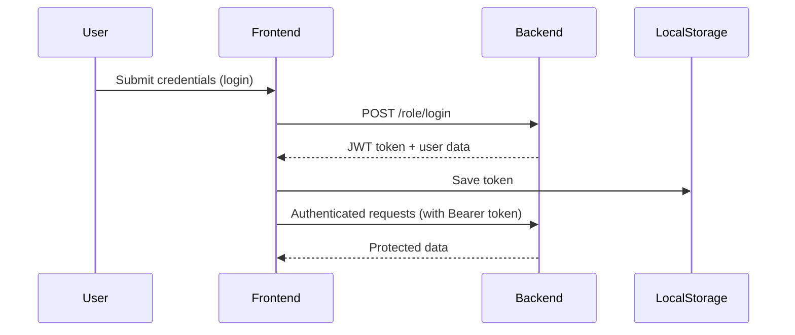

<h1 align="center">
  💼 Bank-Management-System — Multi-Role Bank Management System 💼
</h1>

<p align="center">
  
  
  
  
  
</p>

---

## ✨ Overview

🚀 **Bank Management System** is a full-stack banking management system designed to handle:
- Secure multi-role authentication using JWT
- Role-specific dashboards for Bank Workers, Branch Managers, Bank Managers, and Account Holders
- Account creation, money transfer, loan request, loan approval, and repayment tracking
- Clean and responsive UI (TailwindCSS), optimized for both desktop and mobile

---

## 🔑 Key Features

- 🔐 **JWT Authentication** per role
- 📊 **Dynamic Dashboards** with real-time data
- 🏦 **Account Management** (Create, View, Edit)
- 💸 **Money Transfer** (peer-to-peer inside bank)
- 🧾 **Loan Request & Approval System**
- 💳 **Loan Repayment Tracking**
- 📂 **Branch Hierarchy** (Manager → Worker → Holder)
- 📱 **Fully Responsive** using TailwindCSS

---

## 🛠️ Tech Stack

| Layer        | Tech                             |
|-------------|----------------------------------|
| Frontend    | React + Vite + TailwindCSS       |
| Backend     | Node.js + Express.js             |
| Database    | MongoDB + Mongoose               |
| Auth        | JSON Web Tokens (JWT)            |
| Deployment  | Vercel / Render / Firebase       |

---

## 🏗️ Project Structure
/frontend → React (Vite)  
/backend → Node.js + Express  
/models → Mongoose schemas  
/routes → Role-based APIs  
/public → Static assets  
README.md → Project documentation  

---


---

## 🔐 Authentication Flow



---

# Clone repository
git clone https://github.com/ommprakashsahu1234/Bank-Management-System.git

# Setup backend
```plaintext
cd Bank-Management-System/backend  
npm install  
npm run dev
```

# Setup frontend
```plaintext
cd ../frontend  
npm install  
npm run dev
```

# Visit frontend at: http://localhost:5173
# Visit backend at: http://localhost:5000
